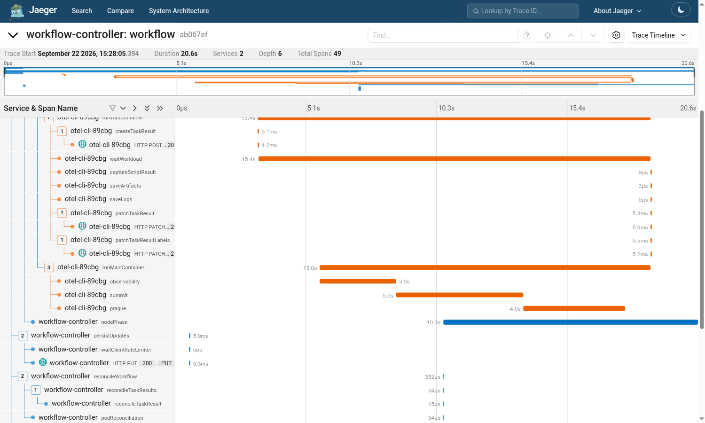

# Two Carriers in One Pod: Argo to an Instrumented CLI

Demo 1 crossed a process boundary once. This one crosses it twice inside a single
Kubernetes pod, and neither hop needs any application code.

```text
workflow-controller -- pod environment {TRACEPARENT} --> argoexec -- child environment {TRACEPARENT} --> otel-cli
```

The Argo workflow-controller creates the pod. It injects the W3C Trace Context of
the span it is holding into **every container's environment** as `TRACEPARENT`,
using the same environment carrier convention demo 1 used, and records that same
trace id on the Workflow object as an annotation.

Inside the pod, argoexec (Argo's executor) extracts that context, starts its own
`runMainContainer` span, and then **re-injects the new context** into the
environment of the process it launches. So the context the user's program sees is
not the controller's span, it is the executor's — a second injection, one hop
further down.

`otel-cli` reads `TRACEPARENT` from its environment like any OpenTelemetry-aware
tool. It is an off-the-shelf binary. Nobody wrote propagation code to make this
work, and the workflow YAML mentions trace context nowhere.

## Prerequisites

The [demo cluster](../cluster/README.md) has everything this needs:
`../cluster/deploy.sh`. To use your own cluster instead, you need:

- Argo Workflows, with `OTEL_EXPORTER_OTLP_ENDPOINT` set on the
  workflow-controller so it emits traces
- Jaeger, receiving from the same collector
- A namespace whose pods can reach that collector. The workflow assumes
  `default`.

## Run it

```sh
kubectl create -n default -f workflow.yaml
```

Then open Jaeger, pick the `workflow-controller` service, and open the newest
trace. Or jump straight to it:

```sh
kubectl get wf -n default -o custom-columns=\
NAME:.metadata.name,TRACE:'.metadata.annotations.workflows\.argoproj\.io/trace-id'
```

## What you should see

One trace, one root, about 49 spans:

```text
workflow                          (workflow-controller)
└── node
    └── createWorkflowPod
        ├── runInitContainer      (argoexec)
        ├── runWaitContainer      (argoexec)
        └── runMainContainer      (argoexec)
            ├── observability     (otel-cli)   3.0s
            ├── summit            (otel-cli)   5.0s
            └── prague            (otel-cli)   4.0s
```



## What to point out

1. The workflow author wrote no OpenTelemetry code and named no propagator. The
   only trace-related thing in `workflow.yaml` is an `echo` of `$TRACEPARENT`,
   and that is there purely so the audience can see the value exists.
2. There are **two** injections, not one. The controller injects into the pod
   environment; the executor injects again into the child process environment,
   with its own span as parent. That is why `observability` hangs off
   `runMainContainer` rather than off `node`.
3. `otel-cli` is a general-purpose binary that knows nothing about Argo. It works
   because both sides agreed on the environment carrier, not because they were
   built together.
4. The same trace id is on the Workflow object as an annotation, so the
   orchestrator's own records and the telemetry can be joined without a lookup.

## Notes

- The three span names are just labels; change them in `workflow.yaml`.
- If `TRACEPARENT` prints as `<unset>` in the step logs, the controller is not
  exporting traces, so it never had a context to inject. Check
  `OTEL_EXPORTER_OTLP_ENDPOINT` on the workflow-controller pod.
