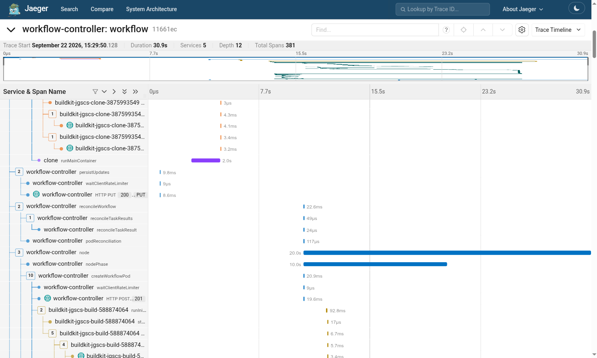

# The Carrier Does Not Care What Is Downstream: Argo to BuildKit

Same two environment-carrier hops as demo 2, but now the workload is a real build
tool, and the workflow runs two steps that respond to the carrier very
differently.

```text
workflow-controller -- pod environment {TRACEPARENT} --> argoexec -- child environment {TRACEPARENT} --> git / buildctl
```

**The clone step** runs `git`. Git has never heard of OpenTelemetry. It receives
`TRACEPARENT` in its environment and ignores it completely.

**The build step** runs BuildKit, which is instrumented. It extracts the same
variable from the same place and produces a whole tree of its own spans beneath
the executor's.

Put side by side in one trace, those two steps show exactly what the carrier does
and does not do: it delivers context, and nothing more. What a process does with
it afterwards is entirely that process's business.

The build itself is a multi-stage Dockerfile with two builder stages rooted in
different base images and no dependency between them, so BuildKit resolves and
pulls them concurrently, then converges at the `COPY --from` lines.

## Prerequisites

The [demo cluster](../cluster/README.md), brought up with
`../cluster/deploy.sh`. The build pushes to its registry, which pods reach as
`host.k3d.internal:5000`.

## Run it

```sh
kubectl create -n default -f workflow.yaml
```

Takes about half a minute. Two pods, about 380 spans, of which the clone step
costs only 18.

## What you should see

### The clone step: a carrier with no reader

`runMainContainer` for the clone step runs for two seconds and has **nothing
nested inside it**. The next span in the trace belongs to the controller again:



### The build step: the same carrier, read

The build step's `runMainContainer` has around 250 descendants. All three base
images resolve on the same tick, because nothing forces them to be sequential:

```text
t+14.4s  1.3s  resolving gcr.io/distroless/static-debian13
t+14.4s  1.2s  resolving docker.io/library/node:lts-alpine3.24
t+14.4s  1.2s  resolving docker.io/library/golang:1.27.1-alpine3.24

[gobuild  2/4] WORKDIR   |  [webbuild 2/4] WORKDIR      in lockstep
[gobuild  4/4] RUN go build   |  [webbuild 4/4] RUN node build.js
[stage-2 2/4] COPY --from=gobuild   ... the branches rejoin
```

## What to point out

1. Two processes, one carrier, opposite outcomes. `git` drops the context on the
   floor; BuildKit builds a subtree from it. Neither was configured differently.
2. Nothing in the workflow tells BuildKit about the trace. It reads
   `TRACEPARENT` itself, because it already speaks OpenTelemetry.
3. An uninstrumented step is not a hole in the trace. You still see it, with
   accurate timing, because the *executor* around it is instrumented. You simply
   see nothing about its internals.
4. The build graph's shape is visible in the span timings: parallel where the
   Dockerfile allows it, serial where it does not.

## Notes

- The clone is load-bearing rather than scenery: it passes the repository's
  commit id to the build as an artifact, and the Dockerfile stamps it into the
  image.
- That artifact carries `mode: 0644` deliberately. Argo stages artifacts as
  `0600` owned by root, and rootless BuildKit runs as uid 1000, so without it the
  builder cannot read the file — and the failure is silent, producing an empty
  file in the image and a successful build.
- Each step sets `OTEL_SERVICE_NAME`. Without it the service name defaults to the
  pod name, which is long enough to crowd span names out of a trace viewer.
- The build context is inlined in the workflow as `raw` artifacts, so there is no
  shared volume and nothing to clone for the Dockerfile itself.
