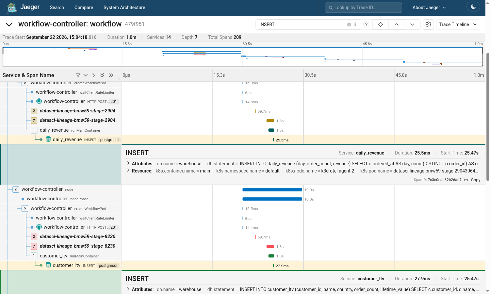
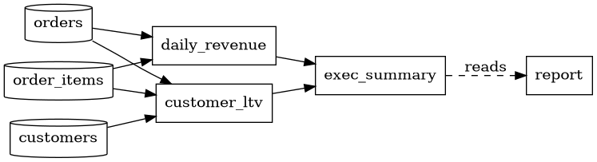

# What the Carrier Buys You: Data Lineage From Traces

The previous demos showed context reaching a workload. This one shows why that is
worth doing, and it is also the demo where the carrier is *not* read for you.

A data pipeline reads and writes Postgres tables. The pipeline author wrote plain
`psycopg` with **no OpenTelemetry imports at all**. The OpenTelemetry operator
auto-instruments the container, so every SQL statement becomes a span carrying
the statement text. A final step then reads the workflow's own trace back out of
Jaeger and derives a table-level lineage graph from those statements.

It never reads the pipeline source. It would work the same against a pipeline in
a language nobody on the team can read.

```text
workflow-controller -- pod environment {TRACEPARENT} --> argoexec -- child environment {TRACEPARENT} --> python
```

## The gap this demo exists to show

Python auto-instrumentation **does not read the environment carrier**. Its
`sitecustomize.py` only calls `initialize()`, which loads the distro,
configurators and instrumentors — it never establishes trace context from
`TRACEPARENT`. Left alone, every SQL span would start its own trace and there
would be no single trace to analyse.

`datasci/tracectx.py` is the ten-line bridge, and it is owned by the platform,
not the pipeline author:

```python
ctx = extract(os.environ, getter=EnvironmentGetter())
context.attach(ctx)
runpy.run_path(sys.argv[1], run_name="__main__")
```

`EnvironmentGetter` is the same one demo 1's Python CLI uses. It ships in
`opentelemetry-api` and normalises `traceparent` to `TRACEPARENT`. Invoked as
`python -m tracectx pipeline.py <stage>`, so `pipeline.py` stays untouched.

## Prerequisites

The [demo cluster](../cluster/README.md), brought up with
`../cluster/deploy.sh`.

The operator's injected Python distro ships **only** the HTTP OTLP exporter, and
forces `OTEL_EXPORTER_OTLP_PROTOCOL=http/protobuf`. That is why the demo
cluster's collector also listens for HTTP on **4318**, and its `Instrumentation`
resource points Python there via `spec.python.env` while Go components keep gRPC
on 4317.

## Run it

```sh
# 1. the warehouse, with seeded raw tables
kubectl create namespace warehouse
kubectl apply -n warehouse -f warehouse-secret.yaml
kubectl apply -n default   -f warehouse-secret.yaml   # the pipeline runs here
kubectl apply -f warehouse.yaml
kubectl rollout status -n warehouse deployment/warehouse --timeout=120s

# 2. the pipeline image, pushed to the demo cluster's registry
docker build -t localhost:5000/datasci:1 datasci/
docker push  localhost:5000/datasci:1

# 3. the pipeline
kubectl create -n default -f workflow.yaml
```

The image deliberately contains **no** OpenTelemetry packages — the operator
injects those, and shipping our own risks clashing on `PYTHONPATH`.

## What you should see

In Jaeger, the SQL spans sit under `runMainContainer`, and each carries the
statement the analysis later parses:



The final step prints the graph and writes it as a workflow artifact:



```text
customer_ltv     reads=[customers, orders, order_items]  writes=[customer_ltv]
daily_revenue    reads=[orders, order_items]             writes=[daily_revenue]
exec_summary     reads=[daily_revenue, customer_ltv]     writes=[exec_summary]
report           reads=[exec_summary]                    writes=-
```

## What to point out

1. The pipeline author wrote no telemetry code. The lineage is a property of the
   platform, not of the application.
2. Lineage is derived from what the pipeline **actually did**, not from what the
   schema contains. `products` exists in the warehouse and never appears in the
   graph, because nothing read it.
3. The `setup` step's `DROP`/`CREATE` statements are in the trace but contribute
   no edges. DDL names a table without moving data between tables. The transform
   stages only `INSERT`, the way a real revenue or LTV table accumulates.
4. This is the one place where the carrier is not free: Python needed a shim.
   That is a gap in the Python auto-instrumentation, not in the carrier, and it
   is the argument for standardising the environment carrier so SDKs read it the
   way they already read HTTP headers.

## Notes

- Each stage sets `OTEL_SERVICE_NAME` to its own name. Without it, all pods share
  the Argo template name and the analysis cannot tell the stages apart.
- Postgres uses an `emptyDir`, so restarting it re-seeds. Self-contained and
  idempotent, not durable.
- The lineage step polls Jaeger until the expected spans arrive, because it runs
  inside the very trace it is analysing.
